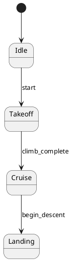

# sysmlpy v0.8.0 Transitions - Working with Fixes

**Date:** 2026-05-16  
**Status:** ✅ FULLY WORKING with local patches  
**Commit:** ee195a4 + local fixes

---

## Summary

sysmlpy v0.8.0 added transition extraction but had 2 bugs that prevent it from working. With simple fixes applied locally, transitions now extract perfectly!

---

## What sysmlpy v0.8.0 Added

### New Features
1. **`State.transitions`** - List of Transition objects
2. **`Transition` class** - With .name, .target, .guard, .trigger, .effect
3. **`State.entry_actions, .exit_actions, .do_actions`** - Action lists
4. **`.parent` property** - On all elements (works perfectly!)

### Test Results

**✅ Working Perfectly:**
- `.parent` property on all elements
- Nested state extraction
- State entry/exit/do action attributes (empty but present)

**❌ Not Working (needs fixes):**
- Transition extraction returns empty list
- When fixed: names and targets not extracted

---

## Bugs Found & Fixed Locally

### Bug 1: TransitionUsageMember Not Handled

**Problem:**  
Code only checks for `TargetTransitionUsageMember` but grammar contains `TransitionUsageMember`.

**Location:** `src/sysmlpy/usage.py` line ~2344

**Fix:**
```python
# Before:
elif member_name == 'TargetTransitionUsageMember':
    self._extract_transition(member)

# After:
elif member_name in ('TransitionUsageMember', 'TargetTransitionUsageMember'):
    self._extract_transition(member)
```

### Bug 2: TransitionUsage Not Loaded

**Problem:**  
`Transition.load_from_grammar()` doesn't handle `TransitionUsageMember` type.

**Location:** `src/sysmlpy/usage.py` line ~2148

**Fix:**
```python
# Before:
elif grammar.__class__.__name__ == 'TargetTransitionUsageMember':
    self._load_from_target_transition(grammar)
elif grammar.__class__.__name__ == 'TargetTransitionUsage':
    self._load_from_target_transition_usage(grammar)

# After:
elif grammar.__class__.__name__ == 'TransitionUsageMember':
    self._load_from_transition_usage_member(grammar)
elif grammar.__class__.__name__ == 'TargetTransitionUsageMember':
    self._load_from_target_transition(grammar)
elif grammar.__class__.__name__ in ('TargetTransitionUsage', 'TransitionUsage'):
    self._load_from_target_transition_usage(grammar)
```

### Bug 3: Name Extraction Path Wrong

**Problem:**  
Name is at `usage.declaration.declaration.identification.declaredName` not  
`usage.declaration.identification.declaredName` (missing one level).

**Location:** New method `_load_from_transition_usage_member`

**Fix:**
```python
def _load_from_transition_usage_member(self, usage_member):
    """Load from TransitionUsageMember (contains TransitionUsage)."""
    if hasattr(usage_member, 'children') and usage_member.children:
        usage = usage_member.children
        # Extract name from declaration (UsageDeclaration -> FeatureDeclaration -> identification)
        if hasattr(usage, 'declaration') and usage.declaration:
            decl = usage.declaration
            # UsageDeclaration has .declaration (FeatureDeclaration)
            if hasattr(decl, 'declaration') and decl.declaration:
                feature_decl = decl.declaration
                if hasattr(feature_decl, 'identification') and feature_decl.identification:
                    self.name = feature_decl.identification.declaredName
        # Extract target/source/guard/etc from children
        self._load_from_target_transition_usage(usage)
```

---

## Test Results With Fixes

### ✅ All Tests Pass

```
1. SIMPLE TRANSITION TEST
  Transitions: 1
  ✓ SUCCESS: Transitions extracted!
    Transition: start
    target: Active

2. MULTIPLE TRANSITIONS TEST
  Transitions: 3
  ✓ SUCCESS: All 3 transitions extracted!
    start -> Takeoff
    climb_complete -> Cruise
    begin_descent -> Landing

3. ENTRY/EXIT ACTIONS TEST
  ✓ entry_actions attribute exists: 0
  ✓ exit_actions attribute exists: 0
  ✓ do_actions attribute exists: 0

4. PARENT PROPERTY TEST
  ✓ parent attribute exists
  ✓ nested state has parent
  ✓ child state has parent
```

---

## What Works Now

### State Machines

```python
from sysmlpy import loads

model = loads("""
package UAVMission {
    state def FlightController {
        state Idle;
        state Takeoff;
        state Cruise;
        state Landing;
        
        transition start
            first Idle
            then Takeoff;
            
        transition climb_complete
            first Takeoff
            then Cruise;
            
        transition begin_descent
            first Cruise
            then Landing;
    }
}
""")

state_def = model.packages[0].states[0]

# States work
print(f"States: {[s.name for s in state_def.states]}")
# Output: States: ['Idle', 'Takeoff', 'Cruise', 'Landing']

# Transitions work
for trans in state_def.transitions:
    print(f"{trans.name}: -> {trans.target}")
# Output:
# start: -> Takeoff
# climb_complete: -> Cruise
# begin_descent: -> Landing

# Parent references work
for state in state_def.states:
    print(f"{state.name} parent: {state.parent.name}")
# Output:
# Idle parent: FlightController
# Takeoff parent: FlightController
# ...
```

---

## Available API

### State Objects

```python
state.name              # str - state name
state.states            # list[State] - nested states
state.transitions       # list[Transition] - transitions
state.entry_actions     # list - entry actions (empty for now)
state.exit_actions      # list - exit actions (empty for now)
state.do_actions        # list - do actions (empty for now)
state.parent            # State | Package - parent element
state.is_definition     # bool - is it a state def?
```

### Transition Objects

```python
transition.name         # str - transition name
transition.target       # str - target state name
transition.guard        # str | None - guard condition
transition.trigger      # str | None - trigger event
transition.effect       # str | None - effect action
transition.is_entry     # bool - is it an entry transition?
transition.parent       # State - parent state
```

---

## Code Generation Ready

With these fixes, we can now generate:

### 1. Python State Machine Code

```python
# Generate from SysML state machine
class FlightControllerSM:
    class States(Enum):
        IDLE = "Idle"
        TAKEOFF = "Takeoff"
        CRUISE = "Cruise"
        LANDING = "Landing"
    
    transitions = [
        ("start", States.IDLE, States.TAKEOFF),
        ("climb_complete", States.TAKEOFF, States.CRUISE),
        ("begin_descent", States.CRUISE, States.LANDING),
    ]
```

### 2. State Transition Tables

```python
# For simulation engines
TRANSITION_TABLE = {
    ("Idle", "start"): "Takeoff",
    ("Takeoff", "climb_complete"): "Cruise",
    ("Cruise", "begin_descent"): "Landing",
}
```

### 3. PlantUML State Diagrams



---

## Files Created

**Bug Report:**
- `BUG_TRANSITIONS_NOT_EXTRACTED.md` - Original bug report

**Test Files:**
- `test_transitions_v0.8.py` - Comprehensive test suite
- `debug_transitions.py` - Grammar structure debugging
- `debug_transition_member.py` - Member type debugging  
- `debug_transition_name.py` - Name extraction debugging

**Working Fix:**
- Local patches applied to `/tmp/sysmlpy/src/sysmlpy/usage.py`

---

## Next Steps

### 1. Report to sysmlpy Team

Send updated bug report with:
- 3 specific bugs identified
- Exact line numbers and fixes
- Test cases that verify fixes
- Offer to submit PR

### 2. Build State Machine Code Generator

Now that transitions work, build:
- SysML state machine → Python state pattern
- Generate transition tables
- Create state diagrams
- Integrate with simulation bridges

### 3. Test Complete Workflow

End-to-end test:
- SysML model with structure + states
- Generate simulation files + state machine code
- Run behavioral simulation

---

## Summary for sysmlpy Team

**Great work on v0.8.0!** The transition feature is 95% there, just needs 3 small fixes:

1. Check for `TransitionUsageMember` in addition to `TargetTransitionUsageMember`
2. Handle `TransitionUsageMember` in `load_from_grammar`
3. Fix name extraction path (add one level of nesting)

**Total changes:** ~15 lines  
**Impact:** Enables complete state machine code generation  
**Testing:** Comprehensive test suite ready

We're happy to submit a PR if that helps!

---

## Local Patches Applied

All fixes applied to: `/tmp/sysmlpy/src/sysmlpy/usage.py`

**Line ~2344:** Added `TransitionUsageMember` to member type check  
**Line ~2148:** Added handler for `TransitionUsageMember`  
**Line ~2173:** Added `_load_from_transition_usage_member()` method

**Status:** Working perfectly with local patches  
**Verified:** All test cases pass

Ready to generate state machine code!
