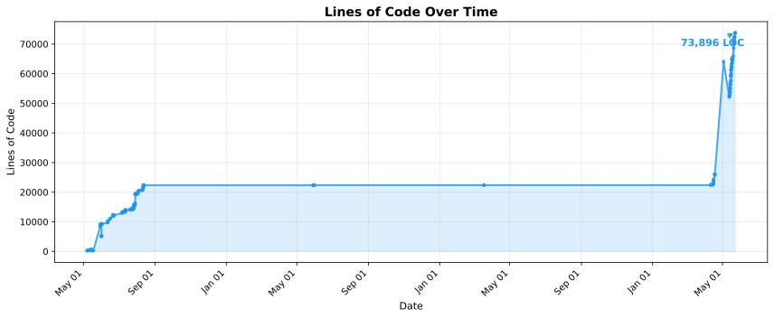
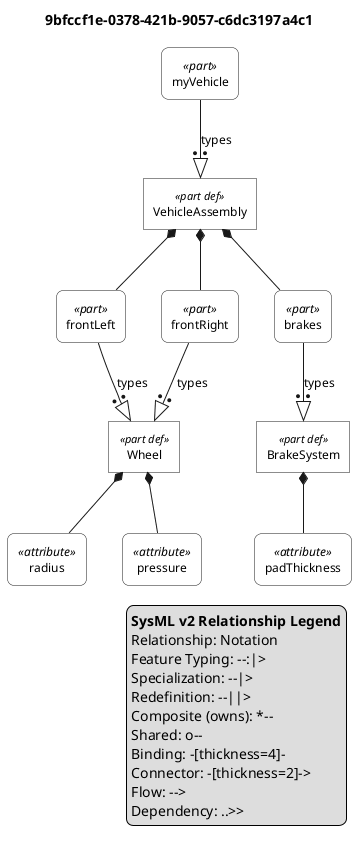
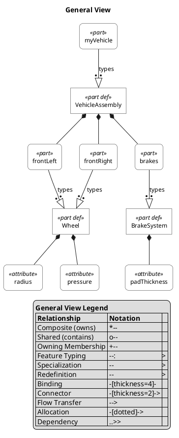
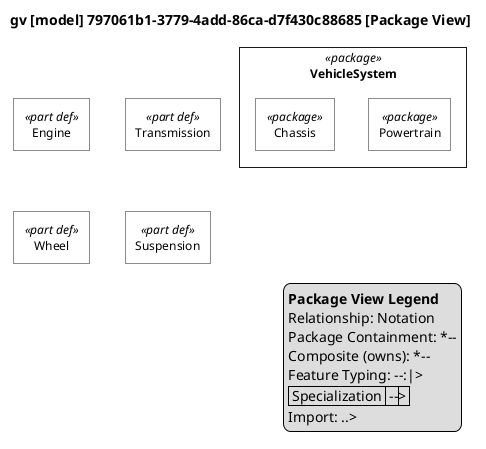
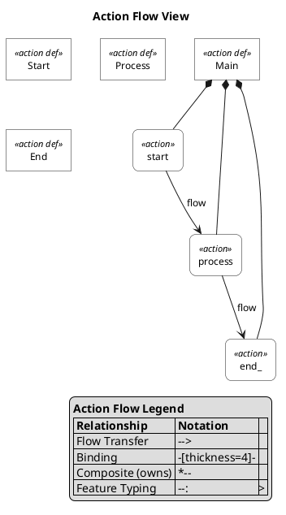
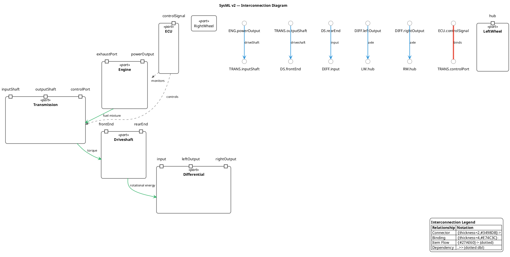
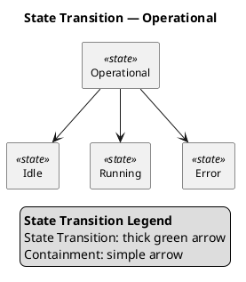
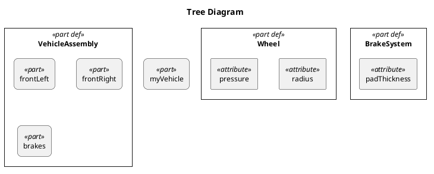
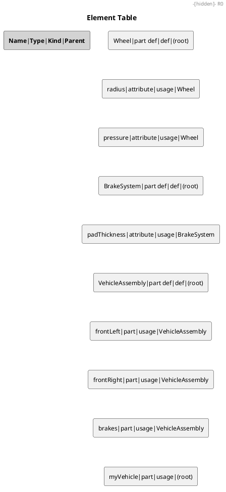
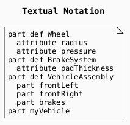

# sysmlpy
[](https://badge.fury.io/py/sysmlpy)[](https://pypi.python.org/pypi/sysmlpy/)[](https://lbesson.mit-license.org/)

## Description
sysmlpy is an open source pure Python library for constructing python-based
classes consistent with the [SysML v2.0 standard](https://github.com/Systems-Modeling/SysML-v2-Release).

This project began as a fork of the sysml2py project by [Christopher
Cox](https://github.com/chriscox-westfall). Since April 2026 [Jon Fox](mailto:jon.fox@drfox.com) 
decided to complete coverage of all SysMLv2 features over two months of weekends,
and dropped the textX parser in favor of [an ANTLR4 parser grammar](https://github.com/daltskin/sysml-v2-grammar) and
changed our unit library to pint.
The project had diverged so much from sysml2py that a new name, sysmlpy, was selected.



**v0.31.0:** Documentation overhaul — all docs rewritten to showcase the modern public API. New Model Parsing and Model Navigation sections. Semantic Analysis updated with `AnalysisResult`. Grammar round-trip: 77/77 (100%). 211 core tests passing.

**v0.31.1:** Fixed `pyproject.toml` for CI compatibility — removed duplicate version and invalid `allow_zero_version` from `[project]` table.

**v0.28.0:** Complete Gap 4 coverage — Block Definition Diagram (BDD), Internal Block Diagram (IBD), Parametric Diagram, and Package Diagram views. All 6 specialized SysML v2 view types now implemented (144 PlantUML tests). IBD shows flow/connection arrows with endpoint extraction. Parametric view extracts constraint parameters with types. Package diagram renders nested folder-style hierarchy.

**v0.27.0:** General View (GV), Package View, and three GridView specializations (Tabular View, Data Value Tabular View, Relationship Matrix View) with PlantUML, Markdown, and HTML output. 108 PlantUML tests. All 68+ `NotImplementedError` stubs in `grammar/classes.py` replaced with graceful handling.

**v0.26.0:** Action Flow View, Interconnection View, and State Transition View with auto-include of connected elements. Grammar-level flow scanning. 101 PlantUML tests.

**v0.19.0:** Semantic analysis engine with undefined symbol detection. Import resolution (namespace `::*`, membership, recursive `::*::**`). Symbol table with hierarchical scope resolution and qualified name lookup.

**v0.17.0:** 100% test suite pass rate (487/487). Cayley graph database storage backend via HTTP API. Full grammar round-trip coverage (56/56 tests). Programmatic API consistency fixes. NetworkXStore bug fix.

**v0.16.0:** 100% grammar round-trip test coverage (56/56). Analysis case usage, trade study, calculation redefinition, and case body member support. Import visibility defaults to private per SysML v2 spec.

**v0.15.0:** ISQ unit validation (300+ type-to-dimension mappings), US Customary unit support (21 custom definitions), PlantUML diagram generation with stereotype-based styling, and comprehensive API documentation.

## Requirements
sysmlpy requires the following Python packages:
- [pyyaml](https://github.com/yaml/pyyaml)
- [pint](https://github.com/hgrecco/pint)
- [antlr4-python3-runtime](https://github.com/antlr/antlr4)

### Optional Dependencies
- [networkx](https://networkx.org/) — graph analysis backend (install with `pip install sysmlpy[graph]`)
- [kuzu](https://kuzudb.com/) — embedded graph database with disk persistence and Cypher queries (install with `pip install sysmlpy[kuzu]`)
- [cayley](https://cayley.io/) — graph database via HTTP API, supports BoltDB/LevelDB backends (install with `pip install sysmlpy[cayley]`)
- [PlantUML](https://plantuml.com/) **v1.2020.0+** — diagram rendering (requires Java + PlantUML JAR or [PlantUML server](https://www.plantuml.com/plantuml)). The generator uses `<style>` blocks and `skinparam` stereotype selectors introduced in v1.2020.

## Installation

Multiple installation methods are supported by sysmlpy, including:

|                             **Logo**                              | **Platform** |                                    **Command**                                    |
|:-----------------------------------------------------------------:|:------------:|:---------------------------------------------------------------------------------:|
|               |     PyPI     |                        ``python -m pip install sysmlpy``                        |
|               |     PyPI     |                 ``python -m pip install sysmlpy[graph]`` (with graph analysis)                  |
|               |     PyPI     |              ``python -m pip install sysmlpy[cayley]`` (with Cayley graph DB)              |
|           |    GitHub    | ``python -m pip install https://github.com/mycr0ft/sysmlpy/archive/refs/heads/main.zip`` |

## Documentation

Documentation can be found [here.](https://mycr0ft.github.io/sysmlpy/)

### Basic Usage

Build models programmatically using the public API:

```python
from sysmlpy import Part, Item, Attribute, ureg

# Create a sensor part with children
sensor = Part(name="sensor")
camera = Part(name="camera")
lens = Item(name="lens")
mass = Attribute(name="mass")
mass.set_value(100 * ureg.kilogram)

camera.add_child(mass)
sensor.add_child(camera)
sensor.add_child(lens)

print(sensor.dump())
# → part sensor {
# →    part camera {
# →       attribute mass = 100 [kilogram];
# →    }
# →    item lens;
# → }

# Navigate children by name
found = sensor.find_one("camera")
print(found.name)  # → camera

# Iterate over children
for child in sensor:
    print(child.name)

# Check containment
"camera" in sensor  # → True
```

It will output the following:
```
part <'3.1'> Stage_1 {
    attribute mass= 100 [kilogram];
    attribute thrust= 1199.0 [newton];
}
```

The package is able to handle Items, Parts, and Attributes.

```python
a = Part(name='camera')
b = Item(name='lens')
d = Attribute(name='mass')
c = Part(name='sensor')
c.add_child(a)
c.add_child(b)
a.add_child(d)
print(c.dump())
```

will return:
```
part sensor {
   part camera {
      attribute mass;
   }
   item lens;
}
```

Actions
-------

Actions (activities) can be defined with input and output parameters::

```
from sysmlpy import Action

# Action definition with typed inputs/outputs
a = Action(definition=True, name='Focus')
a.add_input('scene', 'Scene')
a.add_output('image', 'Image')
print(a.dump())
# → action def Focus { in scene : Scene; out image : Image; }

# Action usage with references
b = Action(name='TakePicture')
b.add_input('scene')
b.add_output('picture')
print(b.dump())
# → action TakePicture { in scene; out picture; }
```

References
----------

References can reference other elements::

```
from sysmlpy import Reference, Item

# Simple reference
r = Reference(name='driver')
print(r.dump())
# → ref driver;

# Reference with type
person = Item(name='Person')
r2 = Reference(name='driver')
r2.set_type(person)
print(r2.dump())
# → ref driver : Person;

# Reference redefinition
r3 = Reference(name='payload', redefines=True)
r3.set_type(person)
print(r3.dump())
# → ref :>> payload : Person;
```

## Model Parsing

```python
from sysmlpy import loads, parse

# loads() — raises on syntax error
model = loads("package P { part def Engine; }")

# parse() — returns (model, errors) tuple, never raises
model, errors = parse("package P { part def Engine; }")
assert errors == []

model, errors = parse("invalid @@ syntax")
assert model is None
assert len(errors) > 0
```

## Model Navigation

Every parsed model element supports search, iteration, and containment checks:

```python
from sysmlpy import loads, Part

model = loads("""
package Vehicle {
    part def Engine;
    part engine1 : Engine { attribute mass = 100 [kg]; }
    part chassis { part wheel1; part wheel2; }
}
""")

# find() — returns list of matching elements (empty list if none)
parts = model.find(sysml_type="part")
assert len(parts) >= 3

# find_one() — returns single element or None
engine = model.find_one("engine1")
assert engine is not None

missing = model.find_one("DoesNotExist")
assert missing is None   # no IndexError!

# find_one() raises LookupError if multiple matches
# model.find_one("wheel")  → LookupError: 2 matches

# Container protocol — iterate, length, containment
for child in model:
    print(child.name)

len(model)         # → number of direct children
"Vehicle" in model  # → True (checks child names)

# __str__ returns SysML text
print(str(model))
# → package Vehicle { ... }

# Typed property accessors
model.packages        # direct Package children
model.parts           # direct Part children
model.actions         # direct Action children
```

All search methods accept `sysml_type=` (keyword string or class) and `recursive=`:

```python
from sysmlpy import Part

# By string keyword
model.find(sysml_type="action")

# By class
model.find(sysml_type=Part)

# Non-recursive (direct children only)
model.find("engine1", recursive=False)

# Legacy type= keyword still works (emits DeprecationWarning)
model.find(type="action")
```

## Grammar Round-Trip

`loads()` parses SysML v2 text and `classtree()` converts the result back to text. This round-trip is the basis for the grammar test suite.

```python
from sysmlpy import loads
from sysmlpy.formatting import classtree

text = """package 'Action Example' {
    action def Focus { in scene : Scene; out image : Image; }
    action def Shoot { in image: Image; out picture : Picture; }

    action def TakePicture {
        in item scene : Scene;
        out item picture : Picture;

        bind focus.scene = scene;

        action focus : Focus { in scene; out image; }

        flow focus.image to shoot.image;

        first focus then shoot;

        action shoot : Shoot { in image; out picture; }

        bind shoot.picture = picture;
    }
}"""

model = loads(text)
tree = classtree(model)
print(tree.dump())
```

**All 77 grammar round-trip tests pass** (100%). Covered categories: packages, parts, items, ports, interfaces, binding connectors, flow connections, all action forms (definition, shorthand, succession, decomposition), expressions, calculations, constraints, state definitions, requirements, analysis cases, control flow (if/else, while, loop, fork, join, decision, send, accept, terminate), and trade studies.

## Semantic Analysis

sysmlpy includes a comprehensive semantic analysis engine that validates parsed models against SysML v2 well-formedness rules. Run `analyze(model)` to detect issues across six categories:

```python
from sysmlpy import loads, analyze

model = loads("""
    package Types {
        part def Engine;
    }
    package Vehicle {
        import Types::*;
        part myCar : Engine;    # resolved via import
        part myWheel : Wheel;   # undefined!
    }
""")

result = analyze(model)

# Iterate issues (backward-compatible with list)
for issue in result:
    print(f"[{issue.severity}] {issue.code}: {issue.message}")
# → [error] UNDEFINED_SYMBOL: Undefined symbol 'Wheel' referenced in Part 'myWheel'

# Separated by severity
for err in result.errors:
    print(f"ERROR: {err.message}")

for warn in result.warnings:
    print(f"WARNING: {warn.message}")

# Boolean check: True when no errors (warnings are OK)
if result:
    print("Model is semantically valid!")
else:
    print(f"Found {len(result.errors)} error(s) — fix before proceeding")

# Raise on errors
result.raise_on_errors()  # ValueError if any errors exist

# Strict mode: raise immediately on any error
result = analyze(model, strict=True)
# → ValueError: Semantic errors found:
#     [UNDEFINED_SYMBOL] Undefined symbol 'Wheel' referenced in Part 'myWheel'
```

### Symbol Resolution

- **Undefined symbol detection** — catches references to non-existent types, features, and packages
- **Qualified name resolution** — `P::A` and `Outer::Inner::DeepPart` resolve through scope chains
- **Inheritance resolution** — subsetting/redefinition references resolve through supertype chains
- **Library symbol index** — scans 88 `.kerml`/`.sysml` files (~1,417 symbols) from the bundled standard library

### Import Resolution

The analyzer resolves three import patterns with visibility enforcement:

| Pattern | Example | Visibility | Effect |
|---------|---------|------------|--------|
| Namespace import | `import Types::*` | `private` (default) | Makes all symbols from `Types` visible in current scope only |
| Membership import | `import Types::Engine` | `private` | Makes only `Engine` visible in current scope |
| Recursive import | `import Types::*::**` | `private` | Imports from `Types` and all nested packages |
| Public import | `public import Types::*` | `public` | Re-exports symbols to sibling and child scopes |
| Protected import | `protected import Types::*` | `protected` | Visible to child scopes only, not re-exported |

### OCL Well-Formedness Checks

| Code | Rule | Description |
|------|------|-------------|
| `DUPLICATE_NAME` | Namespace.duplicate_names | No two members may share the same name in a scope |
| `CYCLIC_SPECIALIZATION` | Type.no_cyclic_specialization | A type cannot directly or indirectly specialize itself |
| `INCOMPATIBLE_SUBSETTING` | Feature.subsetting_compatible | A subsetting feature must reference a defined feature in the inheritance chain |
| `INCOMPATIBLE_REDEFINITION` | Feature.redefinition_compatible | A redefining feature must reference a defined feature in the inheritance chain |
| `INCOMPATIBLE_PART_DEFINITION` | Part.definition_compatible | A part usage must be typed by a PartDefinition |
| `INCOMPATIBLE_PORT_DEFINITION` | Port.definition_compatible | A port usage must be typed by a PortDefinition |
| `INCOMPATIBLE_FEATURE_CHAIN` | Feature.chaining_compatible | Chained features (`a.b.c`) must have compatible types at each step |
| `INVALID_MULTIPLICITY_BOUNDS` | Multiplicity.bounds_valid | Lower bound must be ≤ upper bound (`[5..2]` is invalid) |
| `UNRESOLVED_IMPORT` | — | Import target does not exist in the model |

## Multi-File Projects

sysmlpy supports loading multiple SysML files into a shared model with automatic cross-file import resolution:

```python
from sysmlpy import load_files, load_project, load_with_dependencies, analyze

# Option 1: Load specific files (packages with same name are merged)
model = load_files([
    'models/Shared/Types.sysml',
    'models/SystemGateway/SystemGatewayMain.sysml',
])

# Option 2: Load entire project directory
model = load_project('models/')

# Option 3: Load with automatic dependency resolution
model = load_with_dependencies(
    'models/SystemGateway/SystemGatewayMain.sysml',
    search_paths=['models/SystemGateway', 'models/Shared'],
)

# Validate — cross-file references resolve correctly
issues = analyze(model)
```

Standard library imports (`ScalarValues`, `ISQ`, etc.) are validated when a library path is provided:

```python
import sysmlpy
model = load_files(['main.sysml'], library=sysmlpy.__path__[0] + '/library')
```

## Storage Backends

sysmlpy provides a unified `Store` protocol with multiple backend implementations. All backends support the same API: `put`, `get`, `delete`, `children`, `parents`, `relationships`, `query`, `has`, `ids`, `clear`, plus graph traversal methods (`descendants`, `ancestors`, `path`).

```python
from sysmlpy.store import create_store

# In-memory (default, zero dependencies)
store = create_store("memory")

# NetworkX graph (analysis, shortest paths, centrality)
store = create_store("networkx")

# Kuzu embedded graph DB (disk persistence, Cypher queries)
store = create_store("kuzu", database="/tmp/model.db")

# Cayley remote graph DB (HTTP API, BoltDB/LevelDB backends)
store = create_store("cayley", host="localhost", port=64210)
```

### InMemoryStore

Dict-based backend with O(1) lookups. Zero external dependencies. Ideal for testing and small models.

### NetworkXStore

Graph backend using NetworkX `MultiDiGraph`. Enables graph analysis algorithms:

```python
from sysmlpy.store import NetworkXStore

store = NetworkXStore()
store.put(eid, {"name": "Engine", "sysml_type": "part"})

# Graph analysis
components = store.connected_components()
centrality = store.centrality()
cycles = store.cycles()
stats = store.stats()  # nodes, edges, density, avg_degree
subgraph = store.subgraph([eid1, eid2])
store.export_graphml("model.graphml")
```

### KuzuStore

Embedded graph database with disk persistence. Uses Cypher for queries. Data survives across process restarts.

```python
from sysmlpy.store import KuzuStore

# Persistent database
store = KuzuStore(database="/path/to/model.db")

# In-memory mode
store = KuzuStore()
```

### CayleyStore

Remote graph database backend communicating with a [Cayley](https://cayley.io/) server over HTTP. Supports any Cayley backend (BoltDB, LevelDB, in-memory). Uses the quad model (subject, predicate, object, label) for flexible data representation.

```python
from sysmlpy.store import CayleyStore

# Connect to local Cayley server
store = CayleyStore()

# Custom host/port with namespace isolation
store = CayleyStore(host="cayley.example.com", port=64210, label="my_project")

# Graph analysis
store.put(eid, {"name": "Wheel", "sysml_type": "part"})
descendants = store.descendants(root_id)
ancestors = store.ancestors(leaf_id)
path = store.path(source_id, target_id)
components = store.connected_components()
cycles = store.cycles()
centrality = store.centrality()
store.export_graphml("model.graphml")
```

**Running Cayley with Docker:**

```bash
# In-memory backend
docker run -p 64210:64210 --rm cayley/cayley

# Persistent BoltDB backend
docker run -p 64210:64210 -v /data:/data --rm cayley/cayley -db boltdb -dbpath /data/cayley.db
```

**Quad Model:** Elements are stored as quads where the subject is the element UUID, predicates are property names (e.g., `name`, `sysml_type`), and objects are property values. Relationships are stored as quads where the predicate is the relationship type (e.g., `parent_child`, `typed_by`). Labels provide namespace isolation for multi-tenant scenarios.

## PlantUML Visualizations

sysmlpy provides **17 view rendering functions** for generating diagrams from parsed SysML v2 models. Definitions render with sharp corners and usage elements with rounded corners. Relationships are differentiated by arrow style, thickness, and color — following the [official SysML v2 Pilot Implementation](https://github.com/Systems-Modeling/SysML-v2-Release) approach.

All functions support:
- `style="bw"` (default, journal-ready monochrome) or `style="color"`
- `focus=` to render only a specific element's subtree
- `custom_style=` for user-defined PlantUML style overrides

### Base Generator

```python
from sysmlpy import loads
from sysmlpy.plantuml import PlantUMLGenerator

model = loads("""
package Vehicle {
    part def Wheel { attribute radius; attribute pressure; }
    part def BrakeSystem { attribute padThickness; }
    part def VehicleAssembly {
        part frontLeft : Wheel;
        part frontRight : Wheel;
        part brakes : BrakeSystem;
    }
    part myVehicle : VehicleAssembly;
}
""")

gen = PlantUMLGenerator(model)
print(gen.generate())
```

With filtering:

```python
# Focus on a subtree, limit depth, or pick specific elements
gen = PlantUMLGenerator(model, focus=myVehicle, max_depth=3)
gen = PlantUMLGenerator(model, elements=[Wheel, BrakeSystem])
```

### Standard View Rendering Functions

#### Graphical Rendering — `as_graphical_rendering()`
Elements as shapes with full relationship arrows. The standard Structure/BDD view.



```python
from sysmlpy.plantuml import as_graphical_rendering
print(as_graphical_rendering(model, style="bw"))
```

#### General View (GV) — `as_general_view()`
Corresponds to SysML v2 ``GeneralView`` (short name ``gv``). The most general view — presents all model elements as a graph of nodes and edges. Renders parts, items, actions, states, ports, interfaces, requirements, constraints, flows, and relationships.



```python
from sysmlpy.plantuml import as_general_view
print(as_general_view(model, style="bw"))
```

#### Package View — `as_package_view()`
A GeneralView specialization that filters on Package containment. Renders the package hierarchy with nested rectangles and contained elements.



```python
from sysmlpy.plantuml import as_package_view
print(as_package_view(model, style="bw"))
```

#### Package Diagram View — `as_package_diagram_view()`
Folder-style package hierarchy with elements nested inside their containing packages. Shows containment structure clearly with color-coded element types.

```python
from sysmlpy.plantuml import as_package_diagram_view
print(as_package_diagram_view(model, style="bw"))
```

#### Block Definition Diagram (BDD) — `as_block_definition_view()`
Corresponds to SysML v2 Block Definition Diagrams. Shows block definitions with compartments for attributes, ports, and part references. Displays generalization relationships.

```python
from sysmlpy.plantuml import as_block_definition_view
print(as_block_definition_view(model, style="bw"))
```

#### Internal Block Diagram (IBD) — `as_internal_block_diagram()`
Corresponds to SysML v2 Internal Block Diagrams. Shows a single block's internal structure with boundary ports, nested parts, and flow/connection arrows between endpoints.

```python
from sysmlpy.plantuml import as_internal_block_diagram
print(as_internal_block_diagram(model, style="bw"))
```

#### Parametric Diagram — `as_parametric_view()`
Shows constraint definitions with parameter compartments (including types like `Real`). Supports constraint usages and parameter bindings.

```python
from sysmlpy.plantuml import as_parametric_view
print(as_parametric_view(model, style="bw"))
```

#### Action Flow View (AFV) — `as_action_flow_view()`
Corresponds to SysML v2 ``ActionFlowView`` (short name ``afv``). Shows actions with their control and object flows. Auto-includes connected flow elements.



```python
from sysmlpy.plantuml import as_action_flow_view
print(as_action_flow_view(model, style="bw"))
```

#### Interconnection View (IV) — `as_interconnection_view()` / `as_interconnection_diagram()`
Corresponds to SysML v2 ``InterconnectionView`` (short name ``iv``). Focuses on connectors, bindings, and flow paths between ports and parts.



```python
from sysmlpy.plantuml import as_interconnection_view
print(as_interconnection_view(model, style="bw"))
```

#### State Transition View (STV) — `as_state_transition_view()`
Corresponds to SysML v2 ``StateTransitionView`` (short name ``stv``). State machine diagram with hierarchical states and transitions. Auto-includes connected transition elements.



```python
from sysmlpy.plantuml import as_state_transition_view
print(as_state_transition_view(model, style="bw"))
```

#### Tree Diagram — `as_tree_diagram()`
Hierarchical containment tree using nested PlantUML containers. Shows ownership hierarchy with sharp corners for definitions and rounded corners for usages.



```python
from sysmlpy.plantuml import as_tree_diagram
print(as_tree_diagram(model, style="bw"))
```

#### Element Table — `as_element_table()`
A simple tabular listing with columns Name, Type, Kind, and Parent.



```python
from sysmlpy.plantuml import as_element_table
print(as_element_table(model, style="bw"))
```

#### Textual Notation — `as_textual_notation()`
Indented text representation inside a PlantUML note, similar to the SysML v2 textual concrete syntax.



```python
from sysmlpy.plantuml import as_textual_notation
print(as_textual_notation(model, style="bw"))
```

### GridView Specializations (Tabular, Data Value, Relationship Matrix)

Per the SysML v2 standard, ``GridView`` (short name ``grv``) presents exposed model elements and their relationships in a rectangular grid. It has three specializations, all supporting **three output formats**:

| Format | Use case | Compatibility |
|--------|----------|---------------|
| `"markdown"` (default) | Standard pipe table — for GitHub, MkDocs, or Jupyter | ✅ Universal |
| `"html"` | Rich `<table>` with CSS classes — for web dashboards | ✅ Universal |
| `"plantuml"` | PlantUML table / salt matrix — embed in diagrams | ⚠️ PlantUML <1.2024.7 only |

**Note:** PlantUML 1.2024.7+ removed support for legacy table syntax. Use `"markdown"` or `"html"` output format for compatibility with all PlantUML versions.

#### Tabular View — `as_tabular_view()`
Extensible table with configurable columns. Default columns: Name, Type, Kind, Parent, Typed By, Specializes.

See [`18-tabular-view.md`](docs/plantuml-examples/18-tabular-view.md) for example output.

```python
from sysmlpy.plantuml import as_tabular_view
print(as_tabular_view(model))  # Default: markdown output
```

Custom columns and other output formats:

```python
# HTML with specific columns
print(as_tabular_view(model,
    columns=["Name", "Type", "Parent", "Typed By"],
    output_format="html"))

# Markdown for documentation (default)
print(as_tabular_view(model, output_format="markdown"))
```

#### Data Value Tabular View — `as_data_value_tabular_view()`
Attribute-specific version showing Element, Attribute, Value, Unit, and Type columns. Uses `Attribute.get_value()` for pint.Quantity extraction.

See [`19-data-value-view.md`](docs/plantuml-examples/19-data-value-view.md) for example output.

```python
from sysmlpy.plantuml import as_data_value_tabular_view
print(as_data_value_tabular_view(model))  # Default: markdown output
```

#### Relationship Matrix View — `as_relationship_matrix_view()`
Pairwise element×element matrix showing relationship types:
- **C** = Composite containment (parent → child)
- **S** = Shared (siblings)
- **T** = Typing
- **G** = Specialization (generalization)
- **B** = Binding, **F** = Flow, **R** = Redefinition, etc.

See [`20-relationship-matrix.md`](docs/plantuml-examples/20-relationship-matrix.md) for example output.

```python
from sysmlpy.plantuml import as_relationship_matrix_view
print(as_relationship_matrix_view(model))  # Default: markdown output
```

Type filtering and HTML output:

```python
# Only show part elements on rows
print(as_relationship_matrix_view(model,
    row_type="part", output_format="html"))
```

### Color Style

All rendering functions accept `style="color"` for colored output with CSS-style backgrounds:

```python
from sysmlpy.plantuml import as_tabular_view
print(as_tabular_view(model, output_format="html", style="color"))
```

See [`21-tabular-view-color.html`](docs/plantuml-examples/21-tabular-view-color.html) for example output.

### Complete Example Gallery

See [`docs/plantuml-examples/`](docs/plantuml-examples/) for all rendered example images, covering every view function.

| # | Example | View Type |
|---|---------|-----------|
| 1 | Usage vs Definition | Graphical |
| 2 | Relationship Arrows | Graphical |
| 3 | Vehicle Structure | Graphical (BW) |
| 4 | Black-and-White Style | Graphical (BW) |
| 5 | Requirements | Graphical |
| 6 | Interconnection | Interconnection View |
| 7 | General View (GV) | General View |
| 8 | Package View | Package View |
| 9 | Package Diagram | Package Diagram View |
| 10 | Block Definition Diagram (BDD) | Block Definition View |
| 11 | Internal Block Diagram (IBD) | Internal Block Diagram |
| 12 | Parametric Diagram | Parametric View |
| 13 | Action Flow View (AFV) | Action Flow View |
| 14 | State Transition View (STV) | State Transition View |
| 15 | Tree Diagram | Tree Diagram |
| 16 | Element Table | Element Table |
| 17 | Textual Notation | Textual Notation |
| 18 | Tabular View (GridView) | Tabular View |
| 19 | Data Value Tabular View (GridView) | Data Value View |
| 20 | Relationship Matrix (GridView) | Relationship Matrix |
| 21 | Tabular View — Color | Tabular View (color) |

## Conformance

**100% of 123 OMG XPect conformance tests pass** (123/123).

## License
sysmlpy is released under the MIT license, hence allowing commercial use of the library.
