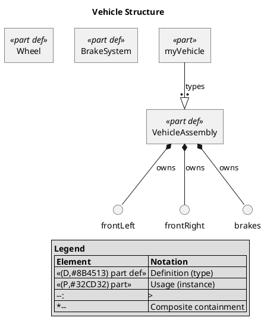

# sysmlpy
[](https://badge.fury.io/py/sysmlpy)[](https://pypi.python.org/pypi/sysmlpy/)[](https://lbesson.mit-license.org/)

## Description
sysmlpy is an open source pure Python library for constructing python-based
classes consistent with the [SysML v2.0 standard](https://github.com/Systems-Modeling/SysML-v2-Release).

This project began as a fork of the sysml2py project by [Christopher
Cox](https://github.com/chriscox-westfall). Since April 2026 [Jon Fox](mailto:jon.fox@drfox.com) 
decided to complete coverage of all SysMLv2 features over two months of weekends,
and dropped the textX parser in favor of [an ANTLR4 parser grammar](https://github.com/daltskin/sysml-v2-grammar) and
changed our unit library to pint.
The project had diverged so much from sysml2py that a new name, sysmlpy, was selected.


**v0.14.0:** 100% conformance test pass rate (123/123). Storage abstraction layer with in-memory and NetworkX graph backends. Convenience functions: find_all, count, traverse, to_dict, to_graph, path_between.

**v0.14.1:** ISQ unit validation (300+ type-to-dimension mappings), US Customary unit support (21 custom definitions), PlantUML diagram generation with stereotype-based styling, strict import visibility enforcement, and comprehensive API documentation.

## Requirements
sysmlpy requires the following Python packages:
- [pyyaml](https://github.com/yaml/pyyaml)
- [pint](https://github.com/hgrecco/pint)
- [antlr4-python3-runtime](https://github.com/antlr/antlr4)

### Optional Dependencies
- [networkx](https://networkx.org/) — graph analysis backend (install with `pip install sysmlpy[graph]`)
- [plantuml](https://plantuml.com/) — PlantUML diagram rendering (requires Java + PlantUML JAR or [PlantUML server](https://www.plantuml.com/plantuml))

## Installation

Multiple installation methods are supported by sysmlpy, including:

|                             **Logo**                              | **Platform** |                                    **Command**                                    |
|:-----------------------------------------------------------------:|:------------:|:---------------------------------------------------------------------------------:|
|               |     PyPI     |                        ``python -m pip install sysmlpy``                        |
|               |     PyPI     |                 ``python -m pip install sysmlpy[graph]`` (with graph analysis)                  |
|           |    GitHub    | ``python -m pip install https://github.com/mycr0ft/sysmlpy/archive/refs/heads/main.zip`` |

## Documentation

Documentation can be found [here.](https://mycr0ft.github.io/sysmlpy/)

### Basic Usage

The code below will create a part called Stage 1, with a shortname of <'3.1'>
referencing a specific requirement or document. It has a mass attribute of 100
kg. It has a thrust attribute of 1000 N. These attributes are created and placed
as a child of the part. Next, we recall the part value for thrust and add 199 N.
Finally, we can dump the output from this class.
```
  from sysmlpy import Attribute, Part, ureg

  a = Attribute(name='mass')
  a.set_value(100 * ureg.kilogram)
  b = Attribute(name='thrust')
  b.set_value(1000 * ureg.newton)
  c = Part(name="Stage_1", shortname="'3.1'")
  c._set_child(a)
  c._set_child(b)
  v = "Stage_1.thrust"
  c._get_child(v).set_value(c._get_child(v).get_value() + 199 * ureg.newton)
  print(c.dump())
```

It will output the following:
```
  part <'3.1'> Stage_1 {
    attribute mass= 100 [kilogram];
    attribute thrust= 1199.0 [newton];
  }
```

The package is able to handle Items, Parts, and Attributes.

```
a = Part(name='camera')
b = Item(name='lens')
d = Attribute(name='mass')
c = Part(name='sensor')
c._set_child(a)
c._set_child(b)
a._set_child(d)
print(c.dump())
```

will return:
```
part sensor {
   part camera {
      attribute mass;
   }
   item lens;
}
```

Actions
-------

Actions (activities) can be defined with input and output parameters::

```
from sysmlpy import Action

# Action definition with typed inputs/outputs
a = Action(definition=True, name='Focus')
a.add_input('scene', 'Scene')
a.add_output('image', 'Image')
print(a.dump())
# → action def Focus { in scene : Scene; out image : Image; }

# Action usage with references
b = Action(name='TakePicture')
b.add_input('scene')
b.add_output('picture')
print(b.dump())
# → action TakePicture { in scene; out picture; }
```

References
----------

References can reference other elements::

```
from sysmlpy import Reference, Item

# Simple reference
r = Reference(name='driver')
print(r.dump())
# → ref driver;

# Reference with type
person = Item(name='Person')
r2 = Reference(name='driver')
r2.set_type(person)
print(r2.dump())
# → ref driver : Person;

# Reference redefinition
r3 = Reference(name='payload', redefines=True)
r3.set_type(person)
print(r3.dump())
# → ref :>> payload : Person;
```

## Grammar Round-Trip

`loads()` parses SysML v2 text and `classtree()` converts the result back to text. This round-trip is the basis for the grammar test suite.

```python
from sysmlpy import loads
from sysmlpy.formatting import classtree

text = """package 'Action Example' {
    action def Focus { in scene : Scene; out image : Image; }
    action def Shoot { in image: Image; out picture : Picture; }

    action def TakePicture {
        in item scene : Scene;
        out item picture : Picture;

        bind focus.scene = scene;

        action focus : Focus { in scene; out image; }

        flow focus.image to shoot.image;

        first focus then shoot;

        action shoot : Shoot { in image; out picture; }

        bind shoot.picture = picture;
    }
}"""

model = loads(text)
tree = classtree(model)
print(tree.dump())
```

**61% of the 56 grammar round-trip tests currently pass** (34/56), covering packages, parts, items, ports, interfaces, binding connectors, flow connections, all action forms (definition, shorthand, succession, decomposition), expressions, calculations, and constraints.

## PlantUML Visualizations

Generate SysML v2 structure diagrams from parsed models using the built-in PlantUML generator. Definitions render with sharp corners and usage elements with rounded corners. Relationships are differentiated by arrow style, thickness, and color — following the [official SysML v2 Pilot Implementation](https://github.com/Systems-Modeling/SysML-v2-Release) approach.

```python
from sysmlpy import loads
from sysmlpy.plantuml import PlantUMLGenerator

text = """package Vehicle {
    part def Wheel {
        attribute radius : LengthValue;
        attribute pressure : PressureValue;
    }

    part def BrakeSystem {
        attribute padThickness : LengthValue;
    }

    part def VehicleAssembly {
        part frontLeft : Wheel;
        part frontRight : Wheel;
        part brakes : BrakeSystem;
    }

    part myVehicle : VehicleAssembly;
}"""

model = loads(text)
gen = PlantUMLGenerator(model, title="Vehicle Structure")
print(gen.generate())
```

Produces PlantUML source that renders as:



### Filtering and Focus

The generator supports filtering to highlight specific elements:

```python
# Show only elements related to 'myVehicle'
gen = PlantUMLGenerator(model, focus="myVehicle")

# Show a custom set of elements
gen = PlantUMLGenerator(model, elements=["Wheel", "BrakeSystem"])

# Limit nesting depth
gen = PlantUMLGenerator(model, max_depth=2)
```

See [`docs/plantuml-examples/`](docs/plantuml-examples/) for 9 rendered examples covering usage vs definition, relationships, vehicle structure, requirements, interconnections, state machines, and activity diagrams.

## Conformance

**100% of 123 OMG XPect conformance tests pass** (123/123).

## License
sysmlpy is released under the MIT license, hence allowing commercial use of the library.
