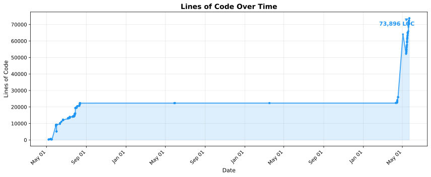
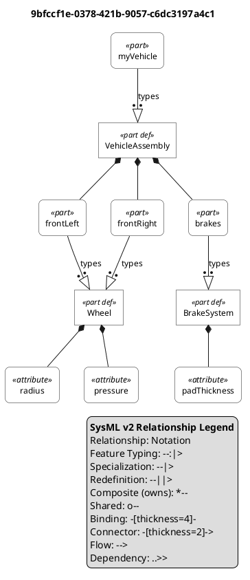
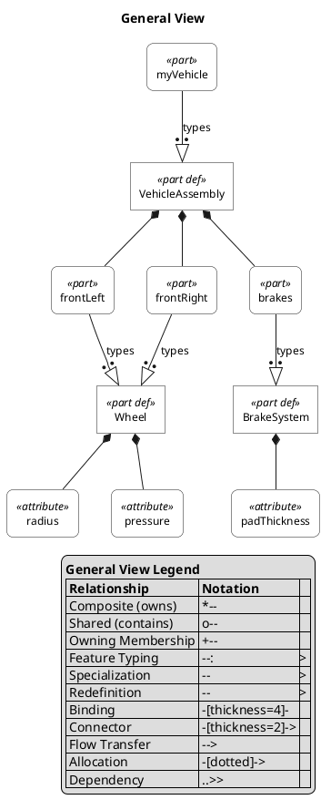
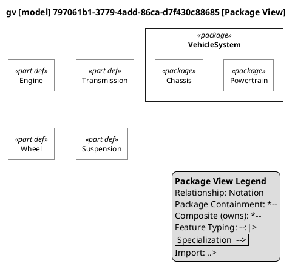
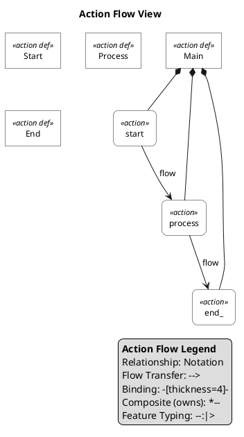
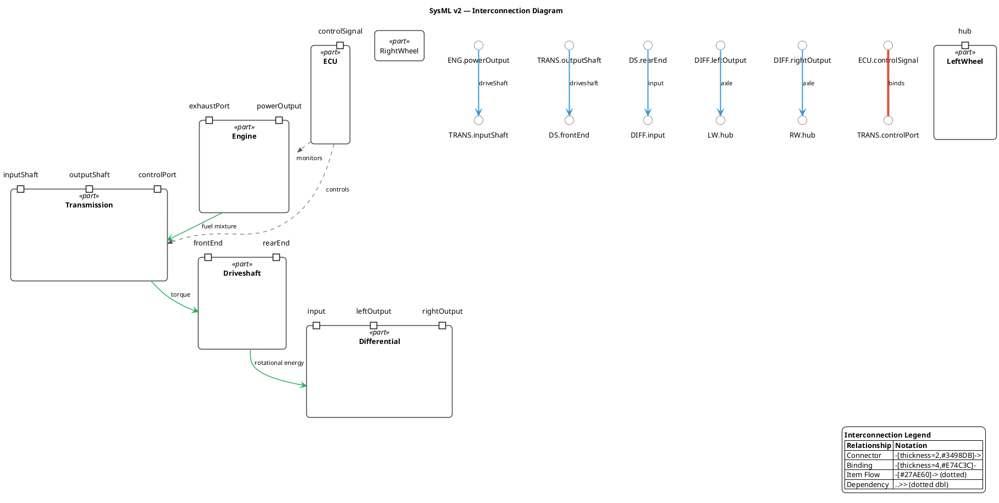
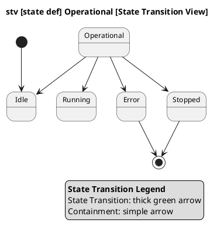
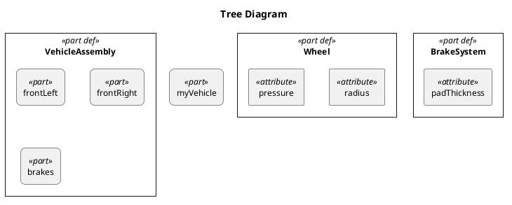
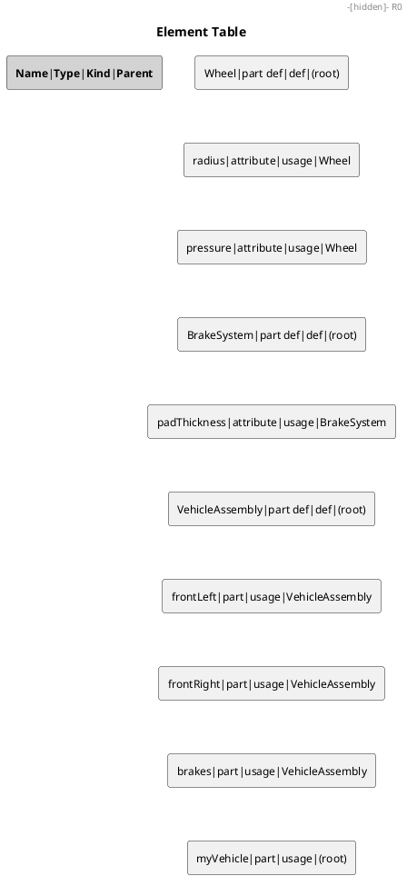
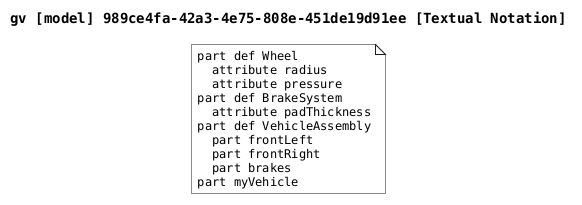

# sysmlpy
[](https://badge.fury.io/py/sysmlpy)[](https://pypi.python.org/pypi/sysmlpy/)[](https://lbesson.mit-license.org/)



## Description
sysmlpy is an open source pure Python library for constructing python-based
classes consistent with the [SysML v2.0 standard](https://github.com/Systems-Modeling/SysML-v2-Release).

This project began as a fork of the sysml2py project by [Christopher
Cox](https://github.com/chriscox-westfall). Since April 2026 [Jon Fox](mailto:jon.fox@drfox.com) 
decided to complete coverage of all SysMLv2 features over two months of weekends,
and dropped the textX parser in favor of [an ANTLR4 parser grammar](https://github.com/daltskin/sysml-v2-grammar) and
changed our unit library to pint.
The project had diverged so much from sysml2py that a new name, sysmlpy, was selected.

**What you get**: full SysML v2 parsing (ANTLR4, 123/123 OMG XPect
conformance), round-trip `dump()`, a semantic analyzer with 31 rule
codes (name resolution, type/unit-checked expressions, OCL
well-formedness), 17 PlantUML views + Java-free boxes rendering,
state-machine simulation, Excel export, a `sysmlpy diff` semantic
model differ, and graph storage backends (memory / NetworkX / Kùzu /
Cayley).

> **Scope note** — a green parse result means the file **parsed
> syntactically**. Expression validation (name resolution, type,
> unit, and dimension checks) runs when you call `analyze(model)`.
> Expression validation also derives dimensions through `*` and `/`
> (`[N]` inferred from `[kg] * [m/s^2]`, v0.75.0).

For release history, see [CHANGELOG.md](CHANGELOG.md).

## Requirements
sysmlpy requires the following Python packages:
- [pyyaml](https://github.com/yaml/pyyaml)
- [pint](https://github.com/hgrecco/pint)
- [antlr4-python3-runtime](https://github.com/antlr/antlr4)

### Optional Dependencies
- [networkx](https://networkx.org/) — graph analysis backend (install with `pip install sysmlpy[graph]`)
- [kuzu](https://kuzudb.com/) — embedded graph database with disk persistence and Cypher queries (install with `pip install sysmlpy[kuzu]`)
- [cayley](https://cayley.io/) — graph database via HTTP API, supports BoltDB/LevelDB backends (install with `pip install sysmlpy[cayley]`)
- [reqif](https://github.com/strictdoc-project/reqif) — ReqIF 1.0 requirements interchange, import/export with any ReqIF-capable tool (install with `pip install sysmlpy[reqif]`; see [ReqIF Interchange](#reqif-interchange-requirements-interchange-format))
- [PlantUML](https://plantuml.com/) **v1.2020.0+** — diagram rendering (requires Java + PlantUML JAR or [PlantUML server](https://www.plantuml.com/plantuml)). The generator uses `<style>` blocks and `skinparam` stereotype selectors introduced in v1.2020.
- [IPython](https://ipython.org/) **v8.0+** — the `%%sysml` Jupyter cell magic (install with `pip install sysmlpy[jupyter]`; see [Jupyter integration](#jupyter-integration))

## Installation

Multiple installation methods are supported by sysmlpy, including:

|                             **Logo**                              | **Platform** |                                    **Command**                                    |
|:-----------------------------------------------------------------:|:------------:|:---------------------------------------------------------------------------------:|
|               |     PyPI     |                        ``python -m pip install sysmlpy``                        |
|               |     PyPI     |                 ``python -m pip install sysmlpy[graph]`` (with graph analysis)                  |
|               |     PyPI     |              ``python -m pip install sysmlpy[cayley]`` (with Cayley graph DB)              |
|           |    GitHub    | ``python -m pip install https://github.com/mycr0ft/sysmlpy/archive/refs/heads/main.zip`` |

## Jupyter integration

With the `jupyter` extra installed (`pip install sysmlpy[jupyter]`), the
`%%sysml` cell magic lets you write SysML v2 textual notation directly in
notebook cells, parsed and accumulated into a persistent session `Model`
exposed in the notebook namespace as `model` (alias `_sysml`):

```python
# once per notebook
%load_ext sysmlpy.ipython_magic
```

```sysml
%%sysml
package Vehicle {
    part def Engine {
        attribute fuelRate : Real;
    }
    part def Vehicle {
        part engine : Vehicle::Engine;
    }
}
```

Re-declaring a package merges at *package-member* granularity: elements
with the same `name` and `sysml_type` replace prior definitions; sibling
members are preserved. Line magics mirror the OMG Pilot Implementation
Jupyter kernel's command set:

| Magic | Purpose |
|-------|---------|
| `%sysml_reset` | Discard the session model |
| `%sysml_list [NAME]` | List packages, or find elements by exact declared name |
| `%sysml_show NAME [--json]` | `dump()` of the AST rooted at a named element |
| `%sysml_viz NAME... [--view V]` | PlantUML view (general\|interconnection\|action\|package\|tree) |

Cell options: `%%sysml --reset` (fresh model), `--file PATH` (parse from a
file; use `-` as the cell body), `--show` (print the round-tripped model).
Parse errors report to stderr with line/column and never discard the
session model. The full magic-command reference — the complete set of the
official [OMG Pilot Implementation Jupyter
kernel](https://github.com/Systems-Modeling/SysML-v2-Pilot-Implementation/tree/master/org.omg.sysml.jupyter.kernel)
and the mapping to this implementation — is in the
[sysml-copier](https://github.com/mycr0ft/sysml-copier) template's
`docs/sysml-magics.md`.

## Interactive REPL

`sysmlpy repl [FILE ...]` is a terminal session in the same spirit: each
submission is a SysML declaration, an expression, or a `%command`, and
declarations accumulate into a session model with the same
member-granularity merge as the Jupyter magics (a re-declared member
replaces its prior definition, sibling members are kept, and a
`note:` line says so). Submissions continue onto a `...>` line while
brackets stay open; a line that is not a declaration evaluates as an
expression. Ctrl-D or `%quit` exits; `%reset` discards the session.

| Command | Purpose |
|---------|---------|
| `%list [NAME]` | Packages (with member counts), or elements matching NAME with qualified names |
| `%show NAME` | `repr()` of the first element named NAME |
| `%dump` | Round-tripped SysML text of the session model |
| `%eval EXPR` | Evaluate an expression against the session model |
| `%set NAME=VALUE` | Bind a what-if value (number / bool / string / unit) |
| `%bindings` | Show current what-if bindings |
| `%calc NAME a, b` | Invoke a calc def with positional literal arguments |
| `%check` | Check the model's constraints (pass/fail report) |
| `%values` | Collected attribute values |
| `%sim [FOCUS]` | Start a simulator session on a state machine |
| `%send TRIGGER` / `%step` / `%state` | Drive / advance / inspect that session |
| `%view NAME [KIND]` | Render a view: `gv` `pkg` `afv` `iv` `stv` `tab` `dvt` `matrix` |
| `%load PATH` / `%save PATH` | Merge a file into the session / write the session out |
| `%reset` / `%quit` | Discard everything / leave the REPL |
| `%help` | Command summary |

Files given on the command line (`sysmlpy repl model.sysml`) are loaded
into the session before the first prompt. The session core is the same
Python API surface used throughout the library, so anything you build in
a REPL session maps one-to-one onto a `ReplSession` scripted from Python.

## Command-Line Tools

sysmlpy ships a CLI (`sysmlpy`, plus `sysmlpy-lsp` for editor support).
Exit codes: `0` = success/clean, `1` = findings at/above the failure
threshold or operational error, `2` = parse/load failure — so
`analyze` and `diff` drop straight into CI pipelines.

| Command | Purpose |
|---------|---------|
| `sysmlpy parse <file>` | Parse a file and print a representation |
| `sysmlpy analyze <file...>` | Semantic analysis; CI-friendly exit codes |
| `sysmlpy diff <old> <new>` | Semantic model diff (text/markdown/json) |
| `sysmlpy view <file>` | Render a PlantUML / Markdown / HTML view |
| `sysmlpy format <file...>` | Pretty-print (canonicalize) SysML files (alias `fmt`) |
| `sysmlpy trace <file>` | Requirement traceability & verification coverage |
| `sysmlpy export <file>` | Export to the JSON interchange format |
| `sysmlpy import <file>` | Import a JSON interchange document as SysML text |
| `sysmlpy reqif-import <file>` | Import a ReqIF file as SysML v2 requirements |
| `sysmlpy reqif-export <file>` | Export model requirements as ReqIF 1.0 XML |
| `sysmlpy eval <file>` | Evaluate expressions, attribute values, constraints |
| `sysmlpy sim <file>` | Simulate a state machine (guards evaluated for real) |
| `sysmlpy xlsx <file>` | Export tabular views to an Excel workbook |
| `sysmlpy repl <file...>` | Interactive REPL: declarations accumulate into a session model; `%eval`, `%sim`, `%view`, `%check`, ... inspect it |
| `sysmlpy-lsp` | Language server (stdio) for SysML v2 editors |

Examples:

```bash
# CI gate: fail the build when analysis finds errors (threshold via --fail-on)
sysmlpy analyze model.sysml

# What changed between two revisions?
sysmlpy diff old.sysml new.sysml --format markdown > changes.md

# Canonicalize a model in place, and render a BDD-style view
sysmlpy format model.sysml
sysmlpy view model.sysml --view sv > model.puml

# Drive a state machine interactively
sysmlpy sim traffic_light.sysml

# Or work in an accumulating session: declare, query, evaluate, simulate
sysmlpy repl
sysml> package Demo { part def Wheel { attribute diameter : Real = 16.0; } }
✓ Demo
sysml> %eval Demo::Wheel::diameter
= 16.0
sysml> %view Demo pkg
sysml> %quit

# Excel workbook of the tabular views
sysmlpy xlsx bill_of_materials.sysml -o bom.xlsx
```

Every subcommand accepts `--help` for its own flags.

## Documentation

Documentation can be found [here.](https://mycr0ft.github.io/sysmlpy/)

### Basic Usage

Build models programmatically using the public API:

```python
from sysmlpy import Part, Item, Attribute, ureg

# Create a sensor part with children
sensor = Part(name="sensor")
camera = Part(name="camera")
lens = Item(name="lens")
mass = Attribute(name="mass")
mass.set_value(100 * ureg.kilogram)

camera.add_child(mass)
sensor.add_child(camera)
sensor.add_child(lens)

print(sensor.dump())
# → part sensor {
# →    part camera {
# →       attribute mass = 100 [kilogram];
# →    }
# →    item lens;
# → }

# Navigate children by name
found = sensor.find_one("camera")
print(found.name)  # → camera

# Iterate over children
for child in sensor:
    print(child.name)

# Check containment
"camera" in sensor  # → True
```

`print(sensor.dump())` renders the SysML text shown above:
`part sensor { part camera { attribute mass= 100[kilogram]; } item lens; }`.

Actions
-------

Actions (activities) can be defined with input and output parameters::

```
from sysmlpy import Action

# Action definition with typed inputs/outputs
a = Action(definition=True, name='Focus')
a.add_input('scene', 'Scene')
a.add_output('image', 'Image')
print(a.dump())
# → action def Focus { in scene : Scene; out image : Image; }

# Action usage with references
b = Action(name='TakePicture')
b.add_input('scene')
b.add_output('picture')
print(b.dump())
# → action TakePicture { in scene; out picture; }
```

References
----------

References can reference other elements::

```
from sysmlpy import Reference, Item

# Simple reference
r = Reference(name='driver')
print(r.dump())
# → ref driver;

# Reference with type
person = Item(name='Person')
r2 = Reference(name='driver')
r2.set_type(person)
print(r2.dump())
# → ref driver : Person;

# Reference redefinition
r3 = Reference(name='payload', redefines=True)
r3.set_type(person)
print(r3.dump())
# → ref :>> payload : Person;
```

## Model Parsing

```python
from sysmlpy import loads, parse

# loads() — raises on syntax error
model = loads("package P { part def Engine; }")

# parse() — returns (model, errors) tuple, never raises
model, errors = parse("package P { part def Engine; }")
assert errors == []

model, errors = parse("invalid @@ syntax")
assert model is None
assert len(errors) > 0
```

## Model Navigation

Every parsed model element supports search, iteration, and containment checks:

```python
from sysmlpy import loads, Part

model = loads("""
package Vehicle {
    part def Engine;
    part engine1 : Engine { attribute mass = 100 [kg]; }
    part chassis { part wheel1; part wheel2; }
}
""")

# find() — returns list of matching elements (empty list if none)
parts = model.find(sysml_type="part")
assert len(parts) >= 3

# find_one() — returns single element or None
engine = model.find_one("engine1")
assert engine is not None

missing = model.find_one("DoesNotExist")
assert missing is None   # no IndexError!

# find_one() raises LookupError if multiple matches
# model.find_one("wheel")  → LookupError: 2 matches

# Container protocol — iterate, length, containment
for child in model:
    print(child.name)

len(model)         # → number of direct children
"Vehicle" in model  # → True (checks child names)

# __str__ returns SysML text
print(str(model))
# → package Vehicle { ... }

# Typed property accessors (available on packages and usage elements;
# a Model root exposes .packages, package nodes expose .parts, etc.)
model.packages        # direct Package children of the model root
pkg = model.find_one("Vehicle")
pkg.parts             # direct Part children (definitions and usages)
```

All search methods accept `sysml_type=` (keyword string or class) and `recursive=`:

```python
from sysmlpy import Part

# By string keyword
model.find(sysml_type="action")

# By class
model.find(sysml_type=Part)

# Non-recursive (direct children only)
model.find("engine1", recursive=False)

# Legacy type= keyword still works (emits DeprecationWarning)
model.find(type="action")
```

## Grammar Round-Trip

`loads()` parses SysML v2 text and `classtree()` converts the result back to text. This round-trip is the basis for the grammar test suite.

```python
from sysmlpy import loads
from sysmlpy.formatting import classtree

text = """package 'Action Example' {
    action def Focus { in scene : Scene; out image : Image; }
    action def Shoot { in image: Image; out picture : Picture; }

    action def TakePicture {
        in item scene : Scene;
        out item picture : Picture;

        bind focus.scene = scene;

        action focus : Focus { in scene; out image; }

        flow focus.image to shoot.image;

        first focus then shoot;

        action shoot : Shoot { in image; out picture; }

        bind shoot.picture = picture;
    }
}"""

model = loads(text)
tree = classtree(model)
print(tree.dump())
```

**All 168 grammar round-trip tests pass** (100%). Covered categories: packages, parts, items, ports, interfaces, binding connectors, flow connections, all action forms (definition, shorthand, succession, decomposition), expressions, calculations, constraints, state definitions, requirements, analysis cases, control flow (if/else, while, loop, fork, join, decision, send, accept, terminate), trade studies, views, viewpoints, render states, portion usages, and annotations.

### Doc comments, interface ends, and flows (v0.96.1)

These constructs are easy to lose between the parser and the API — v0.96.1 makes them first-class and round-trip-safe:

- **`doc /* ... */` comments** — on a package, on any part/item/port/action/... usage or definition, and inside interface bodies — are captured as a `.doc` attribute (a plain string) and re-emitted by `dump()`/`classtree()`, even when the comment shares its body with ports, attributes, or other members.
- **Interface ends** — `end <name>;` and `end <name> ::> part.port;` members of an interface body — are captured as `Interface.ends` (name, type, multiplicity tuples) and `Interface.iface_connections` (`::>` target paths), and survive a dump round-trip.
- **`flow <source> to <target>;`** — parses into a `Flow` child of the owning part, re-emits in the dump, and renders as a flow edge in the Interconnection View.

```python
from sysmlpy import loads, as_interconnection_view
from sysmlpy.formatting import classtree

text = """package WaterSystem {
    doc /* package doc: the coffee water loop */

    part def WaterTank {
        doc /* stores the water */
        port waterOut;
    }

    part def Brewer {
        doc /* heats and brews */
        port waterInlet;
    }

    interface def WaterSupply {
        doc /* the supply contract */
        end supplierPort;
        end consumerPort;
    }

    part def CoffeeMachine {
        doc /* makes coffee */
        part waterTank : WaterTank;
        part brewer : Brewer;

        interface waterLine : WaterSupply {
            doc /* internal plumbing */
            end supplierPort ::> waterTank.waterOut;
            end consumerPort ::> brewer.waterInlet;
        }

        flow waterTank.waterOut to brewer.waterInlet;
    }
}"""

model = loads(text)
package = model.children[0]

# doc text on every element
assert package.doc == "package doc: the coffee water loop"
tank = package.find("WaterTank")[0]
assert tank.doc == "stores the water"

# interface ends: names and ::> targets
machine = package.find("CoffeeMachine")[0]
water_line = next(c for c in machine.children if type(c).__name__ == "Interface")
assert [e[0] for e in water_line.ends] == ["supplierPort", "consumerPort"]
assert water_line.iface_connections == [
    ("supplierPort", "waterTank.waterOut"),
    ("consumerPort", "brewer.waterInlet"),
]

# flows show up in the Interconnection View
assert "flow" in as_interconnection_view(model)

# and everything survives the dump round-trip (docs included)
assert "stores the water" in classtree(model).dump()
```

See `examples/doc_ends_flows.py` for the full walk through the parse → grammar → API layers.

## Semantic Analysis

sysmlpy includes a comprehensive semantic analysis engine that validates parsed models against SysML v2 well-formedness rules. Run `analyze(model)` to detect issues across six categories:

```python
from sysmlpy import loads, analyze

model = loads("""
    package Types {
        part def Engine;
    }
    package Vehicle {
        private import Types::*;
        part myCar : Engine;    // resolved via import
        part myWheel : Wheel;   // undefined!
    }
""")

result = analyze(model)

# Iterate issues (backward-compatible with list)
for issue in result:
    print(f"[{issue.severity}] {issue.code}: {issue.message}")
# → [error] UNDEFINED_SYMBOL: Undefined symbol 'Wheel' referenced in Part 'myWheel'

# Separated by severity
for err in result.errors:
    print(f"ERROR: {err.message}")

for warn in result.warnings:
    print(f"WARNING: {warn.message}")

# Boolean check: True when no errors (warnings are OK)
if result:
    print("Model is semantically valid!")
else:
    print(f"Found {len(result.errors)} error(s) — fix before proceeding")

# Raise on errors
result.raise_on_errors()  # ValueError if any errors exist

# Strict mode: raise immediately on any error
result = analyze(model, strict=True)
# → ValueError: Semantic errors found:
#     [UNDEFINED_SYMBOL] Undefined symbol 'Wheel' referenced in Part 'myWheel'
```

### Symbol Resolution

- **Undefined symbol detection** — catches references to non-existent types, features, and packages
- **Qualified name resolution** — `P::A` and `Outer::Inner::DeepPart` resolve through scope chains
- **Inheritance resolution** — subsetting/redefinition references resolve through supertype chains
- **KerML parser** — OMG-KEBNF-generated ANTLR4 grammar for the Kernel Modeling Language (`sysmlpy.kerml`): `parse` / `parse_file` / `parse_to_dict`; all 130 `.kerml` corpus files (OMG examples + standard libraries) parse, and the library symbol index is backed by real parses (2,986 symbols)
- **Library symbol index** — scans 94 files (36 parsed `.kerml` + 58 `.sysml`) from the bundled standard library (~2,986 symbols)

### Import Resolution

The analyzer resolves three import patterns with visibility enforcement:

| Pattern | Example | Visibility | Effect |
|---------|---------|------------|--------|
| Namespace import | `import Types::*` | `private` (default) | Makes all symbols from `Types` visible in current scope only |
| Membership import | `import Types::Engine` | `private` | Makes only `Engine` visible in current scope |
| Recursive import | `import Types::*::**` | `private` | Imports from `Types` and all nested packages |
| Public import | `public import Types::*` | `public` | Re-exports symbols to sibling and child scopes |
| Protected import | `protected import Types::*` | `protected` | Visible to child scopes only, not re-exported |

### OCL Well-Formedness Checks

The analyzer implements **31 rule codes** in total (severity-tagged
`error`/`warning`), spanning OCL well-formedness, state machines,
requirements, traceability, connectors, and unit-dimension checks —
see [STATUS.md](STATUS.md) for the complete catalogue. Highlights:

| Code | Rule | Description |
|------|------|-------------|
| `DUPLICATE_NAME` | Namespace.duplicate_names | No two members may share the same name in a scope |
| `CYCLIC_SPECIALIZATION` | Type.no_cyclic_specialization | A type cannot directly or indirectly specialize itself |
| `INCOMPATIBLE_SUBSETTING` | Feature.subsetting_compatible | A subsetting feature must reference a defined feature in the inheritance chain |
| `INCOMPATIBLE_REDEFINITION` | Feature.redefinition_compatible | A redefining feature must reference a defined feature in the inheritance chain |
| `INCOMPATIBLE_PART_DEFINITION` | Part.definition_compatible | A part usage must be typed by a PartDefinition |
| `INCOMPATIBLE_PORT_DEFINITION` | Port.definition_compatible | A port usage must be typed by a PortDefinition |
| `INCOMPATIBLE_FEATURE_CHAIN` | Feature.chaining_compatible | Chained features (`a.b.c`) must have compatible types at each step |
| `INVALID_MULTIPLICITY_BOUNDS` | Multiplicity.bounds_valid | Lower bound must be ≤ upper bound (`[5..2]` is invalid) |
| `UNRESOLVED_IMPORT` | — | Import target does not exist in the model |

## Multi-File Projects

sysmlpy supports loading multiple SysML files into a shared model with automatic cross-file import resolution:

```python
from sysmlpy import load_files, load_project, load_with_dependencies, analyze

# Option 1: Load specific files (packages with same name are merged)
model = load_files([
    'models/Shared/Types.sysml',
    'models/SystemGateway/SystemGatewayMain.sysml',
])

# Option 2: Load entire project directory
model = load_project('models/')

# Option 3: Load with automatic dependency resolution
model = load_with_dependencies(
    'models/SystemGateway/SystemGatewayMain.sysml',
    search_paths=['models/SystemGateway', 'models/Shared'],
)

# Validate — cross-file references resolve correctly
issues = analyze(model)
```

Standard library imports (`ScalarValues`, `ISQ`, etc.) are validated when a library path is provided:

```python
import sysmlpy
model = load_files(['main.sysml'], library=sysmlpy.__path__[0] + '/library')
```

## Storage Backends

sysmlpy provides a unified `Store` protocol with multiple backend implementations. All backends support the same API: `put`, `get`, `delete`, `children`, `parents`, `relationships`, `query`, `has`, `ids`, `clear`, plus graph traversal methods (`descendants`, `ancestors`, `path`).

```python
from sysmlpy.store import create_store

# In-memory (default, zero dependencies)
store = create_store("memory")

# NetworkX graph (analysis, shortest paths, centrality)
store = create_store("networkx")

# Kuzu embedded graph DB (disk persistence, Cypher queries)
store = create_store("kuzu", database="/tmp/model.db")

# Cayley remote graph DB (HTTP API, BoltDB/LevelDB backends)
store = create_store("cayley", host="localhost", port=64210)
```

### InMemoryStore

Dict-based backend with O(1) lookups. Zero external dependencies. Ideal for testing and small models.

### NetworkXStore

Graph backend using NetworkX `MultiDiGraph`. Enables graph analysis algorithms:

```python
from sysmlpy.store import NetworkXStore

store = NetworkXStore()
store.put(eid, {"name": "Engine", "sysml_type": "part"})

# Graph analysis
components = store.connected_components()
centrality = store.centrality()
cycles = store.cycles()
stats = store.stats()  # nodes, edges, density, avg_degree
subgraph = store.subgraph([eid1, eid2])
store.export_graphml("model.graphml")
```

### KuzuStore

Embedded graph database with disk persistence. Uses Cypher for queries. Data survives across process restarts.

```python
from sysmlpy.store import KuzuStore

# Persistent database
store = KuzuStore(database="/path/to/model.db")

# In-memory mode
store = KuzuStore()
```

### CayleyStore

Remote graph database backend communicating with a [Cayley](https://cayley.io/) server over HTTP. Supports any Cayley backend (BoltDB, LevelDB, in-memory). Uses the quad model (subject, predicate, object, label) for flexible data representation.

```python
from sysmlpy.store import CayleyStore

# Connect to local Cayley server
store = CayleyStore()

# Custom host/port with namespace isolation
store = CayleyStore(host="cayley.example.com", port=64210, label="my_project")

# Graph analysis
store.put(eid, {"name": "Wheel", "sysml_type": "part"})
descendants = store.descendants(root_id)
ancestors = store.ancestors(leaf_id)
path = store.path(source_id, target_id)
components = store.connected_components()
cycles = store.cycles()
centrality = store.centrality()
store.export_graphml("model.graphml")
```

**Running Cayley with Podman or Docker:**

```bash
# Simplest (tested): persistent BoltDB inside the container
podman run -d --name cayley -p 64210:64210 docker.io/cayleygraph/cayley

# Docker equivalents
docker run -p 64210:64210 --rm cayley/cayley           # in-memory backend
docker run -p 64210:64210 -v /data:/data --rm cayley/cayley \
    -db boltdb -dbpath /data/cayley.db                  # persistent
```

Stored subjects are label-namespaced (`<label>:<element_id>`), so
several stores can share one server without query bleed.

**Quad Model:** Elements are stored as quads where the subject is the element UUID, predicates are property names (e.g., `name`, `sysml_type`), and objects are property values. Relationships are stored as quads where the predicate is the relationship type (e.g., `parent_child`, `typed_by`). Labels provide namespace isolation for multi-tenant scenarios.

## PlantUML Visualizations

sysmlpy provides **17 view rendering functions** for generating diagrams from parsed SysML v2 models. Definitions render with sharp corners and usage elements with rounded corners. Relationships are differentiated by arrow style, thickness, and color — following the [official SysML v2 Pilot Implementation](https://github.com/Systems-Modeling/SysML-v2-Release) approach.

All functions support:
- `style="bw"` (default, journal-ready monochrome) or `style="color"`
- `focus=` to render only a specific element's subtree
- `custom_style=` for user-defined PlantUML style overrides

### Base Generator

```python
from sysmlpy import loads
from sysmlpy.plantuml import PlantUMLGenerator

model = loads("""
package Vehicle {
    part def Wheel { attribute radius; attribute pressure; }
    part def BrakeSystem { attribute padThickness; }
    part def VehicleAssembly {
        part frontLeft : Wheel;
        part frontRight : Wheel;
        part brakes : BrakeSystem;
    }
    part myVehicle : VehicleAssembly;
}
""")

gen = PlantUMLGenerator(model)
print(gen.generate())
```

With filtering:

```python
# Focus on a subtree, limit depth, or pick specific elements
gen = PlantUMLGenerator(model, focus=myVehicle, max_depth=3)
gen = PlantUMLGenerator(model, elements=[Wheel, BrakeSystem])
```

### Standard View Rendering Functions

#### Graphical Rendering — `as_graphical_rendering()`
Elements as shapes with full relationship arrows. The standard Structure/BDD view.



```python
from sysmlpy.plantuml import as_graphical_rendering
print(as_graphical_rendering(model, style="bw"))
```

#### General View (GV) — `as_general_view()`
Corresponds to SysML v2 ``GeneralView`` (short name ``gv``). The most general view — presents all model elements as a graph of nodes and edges. Renders parts, items, actions, states, ports, interfaces, requirements, constraints, flows, and relationships.



```python
from sysmlpy.plantuml import as_general_view
print(as_general_view(model, style="bw"))
```

#### Package View — `as_package_view()`
A GeneralView specialization that filters on Package containment. Renders the package hierarchy with nested rectangles and contained elements.



```python
from sysmlpy.plantuml import as_package_view
print(as_package_view(model, style="bw"))
```

#### Action Flow View (AFV) — `as_action_flow_view()`
Corresponds to SysML v2 ``ActionFlowView`` (short name ``afv``). Shows actions with their control and object flows. Auto-includes connected flow elements. Control nodes render too: `first start` → solid initial dot, `decide`/`merge`/`fork`/`join` → hexagon nodes, `done`/`terminate` targets → final circle, with dotted succession edges (`..>`) and guard conditions as labels.



```python
from sysmlpy.plantuml import as_action_flow_view
print(as_action_flow_view(model, style="bw"))
```

#### Boxes Views — Java-free braille + SVG (v0.68.0)
Native text/graphics rendering through the sibling `diagramboxes`
package — no PlantUML/Java required. Interconnection, action flow and
state transition views render to Unicode-braille text (terminal) or
SVG. Monochrome by design (color-vision friendly).


```python
from sysmlpy.boxes_view import (
    render_interconnection_view_boxes,   # iv: parts + ports + connection edges
    render_action_flow_view_boxes,       # afv: actions + in/out ports + flows
    render_state_transition_view,        # stv: nested composite state boxes
)
print(render_interconnection_view_boxes(model))
```

```
    ⡰⠊⠉⠉⠉⠉⠉⠉⠉⠉⠉⠉⠲⡀     ⡰⠊⠉⠉⠉⠉⠉⠉⠉⠉⠉⠉⠲⡀
    ⡇  «part»    ⡇     ⡇  «part»    ⡇
    ⡇  engine    ⡇     ⡇   pump     ⡇
    ⡇            ⡇     ⡇            ⡇
```

#### Interconnection View (IV) — `as_interconnection_view()` / `as_interconnection_diagram()`
Corresponds to SysML v2 ``InterconnectionView`` (short name ``iv``). Focuses on connectors, bindings, and flow paths between ports and parts.



```python
from sysmlpy.plantuml import as_interconnection_view
print(as_interconnection_view(model, style="bw"))
```

#### State Transition View (STV) — `as_state_transition_view()`
Corresponds to SysML v2 ``StateTransitionView`` (short name ``stv``). State machine diagram with hierarchical states and transitions. Auto-includes connected transition elements.



```python
from sysmlpy.plantuml import as_state_transition_view
print(as_state_transition_view(model, style="bw"))
```

#### Tree Diagram — `as_tree_diagram()`
Hierarchical containment tree using nested PlantUML containers. Shows ownership hierarchy with sharp corners for definitions and rounded corners for usages.



```python
from sysmlpy.plantuml import as_tree_diagram
print(as_tree_diagram(model, style="bw"))
```

#### Element Table — `as_element_table()`
A simple tabular listing with columns Name, Type, Kind, and Parent.



```python
from sysmlpy.plantuml import as_element_table
print(as_element_table(model, style="bw"))
```

#### Textual Notation — `as_textual_notation()`
Indented text representation inside a PlantUML note, similar to the SysML v2 textual concrete syntax.



```python
from sysmlpy.plantuml import as_textual_notation
print(as_textual_notation(model, style="bw"))
```

### GridView Specializations (Tabular, Data Value, Relationship Matrix)

Per the SysML v2 standard, ``GridView`` (short name ``grv``) presents exposed model elements and their relationships in a rectangular grid. It has three specializations, all supporting **three output formats**:

| Format | Use case | Compatibility |
|--------|----------|---------------|
| `"markdown"` (default) | Standard pipe table — for GitHub, MkDocs, or Jupyter | ✅ Universal |
| `"html"` | Rich `<table>` with CSS classes — for web dashboards | ✅ Universal |
| `"plantuml"` | PlantUML table / salt matrix — embed in diagrams | ⚠️ PlantUML <1.2024.7 only |

**Note:** PlantUML 1.2024.7+ removed support for legacy table syntax. Use `"markdown"` or `"html"` output format for compatibility with all PlantUML versions.

#### Tabular View — `as_tabular_view()`
Extensible table with configurable columns. Default columns: Name, Type, Kind, Parent, Typed By, Specializes.

See [`15-tabular-view.md`](docs/plantuml-examples/15-tabular-view.md) for example output.

```python
from sysmlpy.plantuml import as_tabular_view
print(as_tabular_view(model))  # Default: markdown output
```

Custom columns and other output formats:

```python
# HTML with specific columns
print(as_tabular_view(model,
    columns=["Name", "Type", "Parent", "Typed By"],
    output_format="html"))

# Markdown for documentation (default)
print(as_tabular_view(model, output_format="markdown"))
```

#### Data Value Tabular View — `as_data_value_tabular_view()`
Attribute-specific version showing Element, Attribute, Value, Unit, and Type columns. Uses `Attribute.get_value()` for pint.Quantity extraction.

See [`16-data-value-view.md`](docs/plantuml-examples/16-data-value-view.md) for example output.

```python
from sysmlpy.plantuml import as_data_value_tabular_view
print(as_data_value_tabular_view(model))  # Default: markdown output
```

#### Relationship Matrix View — `as_relationship_matrix_view()`
Pairwise element×element matrix showing relationship types:
- **C** = Composite containment (parent → child)
- **S** = Shared (siblings)
- **T** = Typing
- **G** = Specialization (generalization)
- **B** = Binding, **F** = Flow, **R** = Redefinition, etc.

See [`17-relationship-matrix.md`](docs/plantuml-examples/17-relationship-matrix.md) for example output.

```python
from sysmlpy.plantuml import as_relationship_matrix_view
print(as_relationship_matrix_view(model))  # Default: markdown output
```

Type filtering and HTML output:

```python
# Only show part elements on rows
print(as_relationship_matrix_view(model,
    row_type="part", output_format="html"))
```

### Color Style

All rendering functions accept `style="color"` for colored output with CSS-style backgrounds:

```python
from sysmlpy.plantuml import as_tabular_view
print(as_tabular_view(model, output_format="html", style="color"))
```

See [`18-tabular-view-color.html`](docs/plantuml-examples/18-tabular-view-color.html) for example output.

### Complete Example Gallery

See [`docs/plantuml-examples/`](docs/plantuml-examples/) for all rendered example images, covering every view function.

| # | Example | View Type |
|---|---------|-----------|
| 1 | Usage vs Definition | Graphical |
| 2 | Relationship Arrows | Graphical |
| 3 | Vehicle Structure | Graphical (BW) |
| 4 | Black-and-White Style | Graphical (BW) |
| 5 | Interconnection | Interconnection View |
| 6 | General View (GV) | General View |
| 7 | Package View | Package View |
| 8 | Action Flow View (AFV) | Action Flow View |
| 9 | State Transition View (STV) | State Transition View |
| 10 | Tree Diagram | Tree Diagram |
| 11 | Element Table | Element Table |
| 12 | Textual Notation | Textual Notation |
| 13 | Tabular View (GridView) | Tabular View |
| 14 | Data Value Tabular View (GridView) | Data Value View |
| 15 | Relationship Matrix (GridView) | Relationship Matrix |
| 16 | Tabular View — Color | Tabular View (color) |

## ReqIF Interchange (Requirements Interchange Format)

sysmlpy imports and exports **ReqIF 1.0** — the OMG requirements interchange
standard used by DOORS, Polarion, ReqIF Studio, Capella, Enterprise Architect,
and most requirements-management tools. This makes sysmlpy a viable
*single source of truth* for requirements: author them as SysML v2
`requirement` elements, then exchange them with any ReqIF-capable toolchain.

Install the optional dependency once:

```bash
pip install sysmlpy[reqif]
```

### Import — ReqIF → SysML requirements

```python
from sysmlpy import reqif_import, loads

text = reqif_import("requirements.reqif")   # ReqIF XML → SysML v2 text
model = loads(text)                         # → live requirement tree
```

Each ReqIF SpecObject becomes a `requirement` element; the ReqIF
specification hierarchy becomes requirement ownership nesting;
`ReqIF.Text` (XHTML) becomes the requirement's `doc` comment with tags
stripped; other attributes (e.g. `ReqIF.ForeignID`) are folded into the
doc so no data is lost.

### Export — SysML requirements → ReqIF

```python
from sysmlpy import loads, reqif_export

model = loads("model.sysml")
reqif_export(model, "requirements.reqif")
```

Requirement ownership becomes the ReqIF hierarchy; `doc` comments become
`ReqIF.Text` XHTML values.

### CLI

```bash
sysmlpy reqif-import requirements.reqif -o requirements.sysml
sysmlpy reqif-export model.sysml -o requirements.reqif
```

The import direction was validated against real-world anonymized ReqIF
files from multiple vendor flavors (ReqIF Studio, DOORS, Polarion,
Eclipse RMF, Enterprise Architect — see the
[reqif project's corpus](https://github.com/strictdoc-project/reqif/tree/main/tests/integration/reqif_software)),
including a 137-requirement model with a 3-level hierarchy and 14
relations, round-tripped through sysmlpy with exact structural fidelity.

> **Note:** ReqIF "flavors" differ across tools (attribute naming,
> datatypes, relation semantics). The importer handles the common
> `ReqIF.Text` / `ReqIF.ChapterName` / `ReqIF.ForeignID` attributes
> found in every flavor; exotic vendor extensions are skipped
> gracefully. If a file fails to import, it is genuinely malformed.

### Relationship to other tools

- **Cameo / MagicDraw** — export ReqIF from them, import with sysmlpy;
  no license needed on the sysmlpy side.
- **Doorstop** — the [Doorstop](https://doorstop.readthedocs.io) text-file
  requirements tool can serve as a git-native review/publishing front-end;
  exchange via ReqIF or the XLSX bridge.
- **[strictdoc/reqif](https://github.com/strictdoc-project/reqif)** — the
  parser library sysmlpy uses for the ReqIF wire format (Apache-2.0).

## Conformance

**100% of 123 OMG XPect conformance tests pass** (123/123).

## Companion Projects

Two companion tools for the SysML v2 community, created by the same author:

- **[sysml-style](https://github.com/mycr0ft/sysml-style)** — A SysML v2 code formatter with configurable indentation, line width, and bracket style. Can be used standalone or integrated as a pre-commit hook.
- **[sysml-vim](https://github.com/mycr0ft/sysml-vim)** — Vim syntax highlighting and indentation support for SysML v2 textual notation (`.sysml` and `.kerml` files).

## License
sysmlpy is released under the MIT license, hence allowing commercial use of the library.
